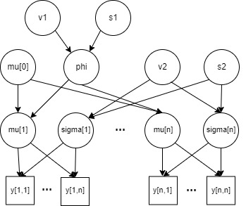

```{r setup, include=FALSE}
knitr::opts_chunk$set(echo = TRUE)
library(ggplot2)
library(StanHeaders)
library(rstan)
set.seed(123)
```
## Exercise 1

### Task a

Formula:
$ p(\alpha, \theta_1 ... \theta_n | y_1 ... y_n) \propto p(\alpha) \prod_{i=1}^n p(\theta_i | \alpha) p(y_i | \theta_i) $

Stan-model:
```{r}
model_a = "
data {
   int<lower=0> n;
   real  y[n];
}

parameters {
   real alpha;
   real theta[n];
}

model {
   alpha ~ p()
   for i in 1:n {
      theta[i] ~ p(alpha)
      y[i] ~ p(theta[i])
   }
}
"
```

### Task b

Formula:
$p(\alpha, \mu_1 ... \mu_n, \theta_{1,1} ... \theta_{m,n} | y_{1,1} ... y_{m,n}) \propto p(\alpha)\prod_{i=1}^m \left[p(\mu_i | \alpha) \prod_{j=1}^{n} p(\theta_{i,j} | \mu_i) p(y_{i,j} | \theta_{i,j})\right]$

Stan-model:
```{r}
model_b = "
data{
   int<lower=0> n;
   int<lower=0> m;
   real  y[n*m];
}

parameters {
   real alpha;
   real mu[m];
   real theta[m][n];
}

model {
   alpha ~ p()
   for i in 0:m-1 {
      mu[i] ~ p(alpha)
      for j in 0:n-1 {
         theta[i][j] ~ p(mu[i])
         y[m*i+j] ~ p(theta[m*i+j])
      }
   }
}
"
```

### Task c

Formula:
$p(\alpha, \gamma, \mu_1 ... \mu_n, \sigma_1 ... \sigma_n | y_1 ... y_n, x_i ... x_n) \propto p(\alpha)p(\gamma) \prod_{i=1}^n p(\mu_i | \alpha_i) p(\sigma_i | \gamma_i) p(y_i | x_i, \mu_i, \sigma_i)$

Stan-model:
```{r}
model_c = "
data {
   int<lower=0> n;
   real x[n];
   real  y[n];
}

parameters {
   real alpha;
   real gamma;
   real mu[n];
   real sigma[n];
}

model {
   alpha ~ p()
   gamma ~ p()
   for i in 1:n {
      mu[i] ~ p(alpha)
      sigma[i] ~ p(gamma)
      y[i] ~ p(mu[i]*x[i], sigma[i]*x)
   }
}
"
```

### Task d

Stan-model:
```{r}
model_d = "
data {
   int<lower=0> n;
   int<lower=0> J;
   real y[J][n]
}

parameters {
   real v1;
   real v2;
   real s1;
   real s2;
   real phi;
   real mu0;
   real mu[J];
   real sigma[J];
}

model {
   v1 ~ p()
   v2 ~ p()
   s1 ~ p()
   s2 ~ p()
   mu0 ~ norm(0, 10^6)
   phi ~ inv_chi2(v1, s1)
   for j in 1:J {
      sigma[j] ~ inv_chi2(v2, s2)
      mu[j] ~ norm(mu0, phi)
      for i in 1:n {
         y[j][i] ~ norm(mu[j], sigma[j])
      }
   }
}"
```



## Exercise 2

In this exercise, we continue the analysis of the white fish larval areas (week 2, exercise 3). We are again interested in analysing whether or not bottom vegetation affects white fish larvae occurrence probability. However, instead of having a common probability of presence parameter across the Gulf of Bothnia, we expand the model so that it allows the probability of presence to vary between sampling areas. This modification to the model encodes an assumption that some areas may be more preferable to white fish than others. 

Let's first explore the data a bit more.
```{r}
# Read the data
data = read.csv("white_fishes_data.csv")
# Form a data table for sites without bottom vegetation
y.noveg = table(data$AREANAME[data$BOTTOMCOV==0], data$WHIBIN[data$BOTTOMCOV==0])
colnames(y.noveg) <- c("y=0","y=1")
N.noveg = rowSums(y.noveg)
# Form a data table for sites with bottom vegetation
y.veg = table(data$AREANAME[data$BOTTOMCOV==1], data$WHIBIN[data$BOTTOMCOV==1])
colnames(y.veg) <- c("y=0","y=1")
N.veg = rowSums(y.veg)

par(mfrow=c(1,2))
plot(N.veg, main="Number of sampling sites", xlab="Area index", ylab="Number of sites")
points(N.noveg, col="red")
legend(1, 39, c("veg.","no veg."),col=c("black","red"), pch=1, cex=1, box.lty=1)
plot(y.veg[,2]/N.veg, main="proportion of sites with whitefish", xlab="Area index", ylab="proportion")
points(y.noveg[,2]/N.noveg, col="red")
print(y.veg)
```

The first figure above shows the number of sampling sites for each of the 19 study areas and both bottom vegetation types (with and without). The second figure shows the proportion of the sites with white fish larvae within each area and bottom vegetation type. It is rather evident that there is considerable variation in the sample proportions of the second figure. However, we would want to know how much of this is actually due to varying probability of presence vs. pure chance. Note also, that there are no sampling sites in Kalajoki (sampling area number 7 below) with vegetation cover. Hence, we have missing data there.
```{r}
veg <- y.veg[19:36]
veg <- append(veg, 0, 6) #adding missing data, copying closest geographical location
noveg <- y.noveg[20:38]
y2 <- aperm(array(c(veg, noveg), dim=c(19,2)))
```
```{r}
N.veg <- append(N.veg, 1,6)
Ns <- aperm(array(c(N.veg, N.noveg), dim=c(19,2)))
```
We will denote by $\theta_{i,c}$ the probability that white fish larvae are present in area $i$ at sites with ($c=1$) or without ($c=0$) bottom vegetation. The data will be denoted by $y_{i,c}$ and $N_{i,c}$ where the former denotes the number of sites with white fish larvae and the latter the total number of sites inside an area $i$ with ($c=1$) or without ($c=0$) bottom vegetation. We will now implement the following model
\begin{align*}
y_{i,c} & \sim \text{Binom}(\theta_{i,c},N_{i,c})\\
\theta_{i,c} & \sim \text{Beta}(\mu_c s_c, s_c-\mu_c s_c) \\
\mu_c &\sim \text{Unif}(0,1) \\
s_c &\sim \text{log-}N(4, 4).
\end{align*}
where $\mu_c$ is the prior mean of $\theta_{i,c}$  and $s_c$ governs the uncertainty about it. 
The parametrization of log-Gaussian distribution $s_c \sim \text{log-}N(m, \sigma^2)$ 
is such that $E[\log(s_c)]=m$ and $Var[\log(s_c)]=\sigma^2$

### Task 1

```{r}
fish_model = "
data {
   int<lower = 0> dim;
   int<lower = 0> n;
   int y[dim, n];
   int total[dim, n];
}

parameters {
   real<lower=0, upper=1> theta[dim, n];
   real<lower=0.01, upper=0.99> mu[dim];
   real<lower=0.01> s[dim];
}

model {
   for (d in 1:dim){
      s[dim] ~ lognormal(4, 2);
      for (site in 1:n){ 
         theta[d, site] ~ beta(mu[d]*s[d], s[d] - mu[d]*s[d]);
         y[d, site] ~ binomial(total[d, site], theta[d, site]);
      }
   }
}
"

```

```{r}
dataset <- list("dim"=2, "n"=19, "y"=y2, "total"=Ns)
post=stan(model_code=fish_model,data=dataset,warmup=500,iter=1000,chains=3,thin=1)

```
```{r}
print(post)
```
The rhat-values are looking splendid all the way, only 1s.

```{r}
plot(post, plotfun= "trace", pars=colnames(as.matrix(post))[1:10], inc_warmup = TRUE)

```
```{r}
plot(post, plotfun= "trace", pars=colnames(as.matrix(post))[30:40], inc_warmup = TRUE)

```
(...) 

This was just a sample of the parameters, but also when plotting the convergences looks sound.

```{r}
stan_ac(post,c("s[1]", "s[2]", "mu[1]", "mu[2]", "theta[1,1]", "theta[2,1]", "theta[1,10]", "theta[2,15]"),inc_warmup = FALSE, lags = 25)
```
(...) 

Also, the autocorrelation is, i.e., close to zero at higher lags.
```{r}
Nsamp=as.matrix(post)

```

```{r}
plot(post, plotfun = "hist", pars = colnames(Nsamp) ,bins=50)

```
(...) 

The plots are quite small, but the general idea can be sensed.

### Task 2

```{r}
diff_mu = Nsamp[,"mu[2]"] - Nsamp[,"mu[1]"]
diff_theta <- matrix(c(0), nrow = 1500, ncol = 18)
ind = 1
for (i in 1:36){
  if (i %% 2 > 0){
    diff_theta[,ind] = Nsamp[,i+1] - Nsamp[,i]
    ind = ind +1
  } else {
    next
  }
}
hist(diff_mu, main="Difference between mu_0 and mu_1")
```
```{r}
for (i in 1:18){
  hist(diff_theta[,i], main = paste("Theta difference in area " , i))
}
```

### Task 3

```{r}
theta1_19_samp <- rbinom(Nsamp[,"theta[1,19]"], 10, Nsamp[,"theta[1,19]"])
theta2_19_samp <- rbinom(Nsamp[,"theta[2,19]"], 10, Nsamp[,"theta[2,19]"])
hist(theta1_19_samp, main="New sample from area 19, vegetation")
hist(theta2_19_samp, main="New sample from area 19, non-vegetation")

```
```{r}
diff_theta_19 <- Nsamp[,"theta[2,19]"] - Nsamp[, "theta[1,19]"]
hist(diff_theta_19, main="Theta difference area 19")
```
(...) 

### Task 4
```{r}
y_tilde_1 <- rbeta(1500, Nsamp[,"mu[1]"]*Nsamp[,"s[1]"], Nsamp[,"s[1]"] - Nsamp[,"mu[1]"]*Nsamp[,"s[1]"])
theta20_1_samp <- rbinom(y_tilde_1, 10, y_tilde_1)
hist(theta20_1_samp, breaks = 10, main="Sample from hypothetic area, vegetation")

```
```{r}
y_tilde_2 <- rbeta(1500, Nsamp[,"mu[2]"]*Nsamp[,"s[2]"], Nsamp[,"s[2]"] - Nsamp[,"mu[2]"]*Nsamp[,"s[2]"])
theta20_2_samp <- rbinom(y_tilde_2, 10, y_tilde_2)
hist(theta20_2_samp, breaks = 10, main="Sample from hypothetic area, non-vegetation")

```
```{r}
diff_y_20 = theta20_2_samp - theta20_1_samp
hist(diff_y_20, main="Theta difference in hypothetic area")

```
(...) 

### Task 5

```{r}
#mean for mu:
mean(Nsamp[,'mu[1]'])
mean(Nsamp[, 'mu[2]'])
```
```{r}
sd(Nsamp[,'mu[1]'])
sd(Nsamp[, 'mu[2]'])

```
If we compare the $\mu$ attained here to what we saw in the $\theta$ in week 2 exercise 3, we see that the results are quite close to each other, with $\mu_{noveg}$ being a bit lower (in week 2 i calculated a $\theta \approx 0.763$. The standard deviation is approximately double as big, perhaps to allow for the bigger variation within the individual sample sites. 

Also, the logic of these parameters is somewhat different. The mean estimated in the hierarchical model tries to capture a true mean of white fish larvae in general, regardless of location within the Gulf of Bothnia. While the individual site-specific $\theta$ show variation that possibly is not exclusively a measure of variation within an identical distribution, but also a sign of a de facto difference in the distribution at different sites.

The Gulf of Bothnia is not of a negligible size, with a length of 725 km. The coastal line is quite different, with mountains in parts of the west side of the gulf and flatlands in other places. Perhaps it is a good idea to assume that the true distribution might differ between different sites within this area, making a hierarchical model somewhat more useful for modelling the prevalence of white fish larvae.


# References

Lari Veneranta, Richard Hudd and Jarno Vanhatalo (2013). Reproduction areas of sea-spawning Coregonids reflect the environment in shallow coastal waters. Marine Ecology Progress Series, 477:231-250. <http://www.int-res.com/abstracts/meps/v477/p231-250/>